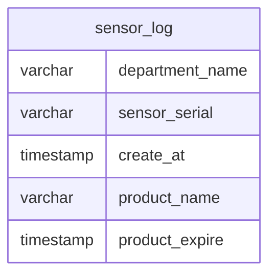

# airflow_demo
Create a data pipeline that uses the `sampledata.py` script to generate data and load it into a PostgreSQL database. 
The pipeline will be managed with Airflow using Airflow docker with LocalExecutor. The airflow docker image is built based on Apache Airflow 3.x as in the official guideline [here](https://airflow.apache.org/docs/apache-airflow/3.0.5/howto/docker-compose/index.html). 

## Folder Structure
- /dags/ : keep DAG pipeline file.
- /dags/sql : keep sql file required as part of DAG.
- /scripts/ : keep `sampledata.py` and data_sample folder.

## Prerequisite
- Docker with Memory >= 10GB
- Make sure port 5432 and 8080 are available for postgres and airflow apiserver

## Database diagram
The database diagram defined as below\
or equilavant sql can be found in /sql (Simplified for demo only, can add index or partition if needed later) 

## Video Record 
The video of pipeline can be found [here](https://drive.google.com/drive/folders/1tDO5RGfJ0BgpT9Fc5uDFaqRPUOUfrqbx?usp=sharing) 

## Step to Run 
1) Clone github repository to your local machine.
2) Run `docker compose build` to build the custom image defined in the `Dockerfile`.
3) Run `docker compose up airflow-init` to initialize Airflow (only for the first time you set it up)
4) Run `docker compose up -d` to start all Airflow services (Make sure port 8080 is available to connect to Airflow UI or change port of `airflow-apiserver` in docker-compose file)
5) Go to localhost:8080 and trigger the `data_pipeline_postgres` DAG then wait the pipeline to completed.
7) You should be able to see the data in data-postgres database(access using localhost:5432 as default).

**DAG consists of the following steps**
1) Create `sensor_log` table in data-postgres database(using sql script in /dags/sql).
2) Generate sample data by running `sampledata.py`, which produces parquet files in /scripts/data_sample.
3) List all dates from parquet file name (This step will make DAG to run parrallel data ingestion by combining files of the same date in another process).
4) Ingest parquet by streaming CSV into Postgres by using `COPY` command.
5) Cleaning up by remove /scripts/data_sample to free up space.

## Cleaning up
To stop and delete containers, delete volumes with database data and download images, run: `docker compose down --volumes --rmi all` ([Ref](https://airflow.apache.org/docs/apache-airflow/3.0.5/howto/docker-compose/index.html#cleaning-up))
